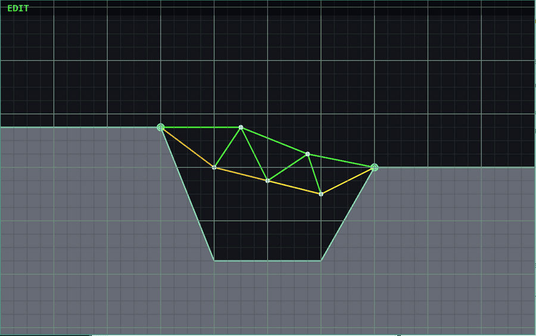

# Beambuilder



A 2D bridge construction game in the spirit of the original *Pontifex / Bridge
Builder*: wireframe trusses on a dark background, color-coded stress, watch your
bridge break under a passing train. Built in Rust with the Bevy game engine.

Physics is hybrid: a linear static FEM solver runs while you edit, coloring each
beam green / yellow / red by axial stress; a mass-spring Verlet simulation
takes over in Test mode, so beams visibly sag, stretch and snap as a small
train rolls across.

## Requirements

- Linux, macOS, or Windows desktop.
- A Rust toolchain (stable, edition 2024 — currently means Rust 1.85 or newer).

### Installing Rust

The recommended installer is [rustup](https://rustup.rs/):

```sh
# Linux / macOS
curl --proto '=https' --tlsv1.2 -sSf https://sh.rustup.rs | sh
```

On Windows, download and run `rustup-init.exe` from <https://rustup.rs>.

Open a new shell after install so `cargo` and `rustc` are on your `PATH`. Check
the version:

```sh
rustc --version   # should report 1.85 or newer
```

If you already have a `rustup` install, update with `rustup update stable`.

### System dependencies

Bevy uses Vulkan / Metal / DX12 via `wgpu`. On Linux you typically already
have what you need, but on a fresh Ubuntu system you may want:

```sh
sudo apt install build-essential pkg-config libudev-dev libasound2-dev \
                 libwayland-dev libxkbcommon-dev
```

macOS and Windows have no extra steps beyond installing Rust.

## Building and running

Clone, then from the project root:

```sh
cargo run                                            # default level
cargo run -- levels/02_wide_gap.level.ron            # pick a different level
cargo build --release                                # optimized binary
```

The first build downloads Bevy and compiles a lot of crates — expect several
minutes. Subsequent builds are incremental and fast.

Available levels live under `assets/levels/`:

- `01_first_gap` — single chasm, the tutorial span.
- `02_wide_gap` — a wider chasm; needs a proper truss.
- `03_step` — left bank is higher than the right; deck slopes down.
- `04_island` — one mid-channel island gives you two shorter spans.
- `05_three_spans` — two islands split the chasm into three bays.

## Controls

| Input | Action |
|---|---|
| Left-click | Place a beam (Edit mode) |
| Right-click | Delete the beam under the cursor |
| Right-drag | Pan the camera |
| Mouse wheel | Zoom in / out |
| `Ctrl+Z` / `Ctrl+Y` (or `Ctrl+Shift+Z`) | Undo / redo |
| `Ctrl+N` | Clear all beams (anchors stay; undoable) |
| `Space` | Start the test run |
| `Esc` | Return to Edit mode |

## Picking a GPU

On hybrid laptops Bevy / `wgpu` defaults to the highest-power adapter. If your
display is wired to the integrated GPU (common with Sway/Wayland on NVIDIA
laptops), force the integrated card:

```sh
WGPU_POWER_PREF=low cargo run
```

## Project layout

```
src/
  main.rs        App + plugin wiring + GameState enum (Menu / Edit / Test / Result)
  camera.rs      Pan / zoom / RMB drag tracking
  cli.rs         Level path resolution
  world/         Level RON loader, terrain + anchor rendering
  edit/          Grid snap, beam draw / delete, undo-redo, clear
  sim/           Shared truss graph + static FEM + dynamic Verlet + train
  ui/            HUD (mode chip, status label)
assets/levels/   Hand-authored level files (RON, hot-reloadable in spirit)
```

The truss graph (`src/sim/graph.rs`) is the single source of truth shared by
both the FEM solver and the dynamic sim — they are two evaluators over one
model, not parallel data structures.

## Adding your own levels

Levels are plain RON data — no recompile needed. Drop a new
`assets/levels/your_name.level.ron` and pass it to `cargo run --`.

The format (see existing files for examples) is:

```ron
(
    anchors: [(x, y), ...],          // fixed support points, world units
    terrain: [(x, y), ...],          // ground silhouette, left to right
    vehicle_spawn: (x, y),           // engine car start position
    goal:          (x, y),           // win when train reaches here
)
```

Coordinates are in world units (~pixels at zoom 1.0). The grid is 32 units,
so multiples of 32 keep things aligned.
